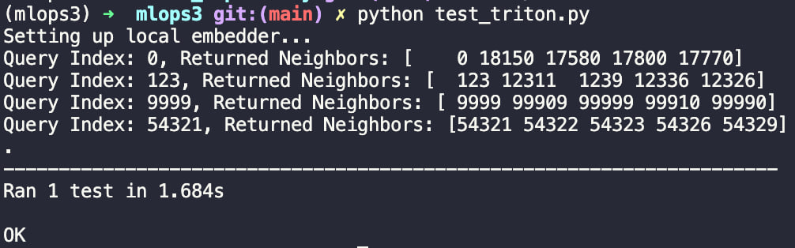

# MLOps3

## Репа

* `generate_index.py`: Скрипт для генерации 100k эмбеддингов и создания FAISS индекса
* `model_repository/`: Директория с конфигурацией и кодом модели для Triton
  * `faiss_search/`: Модель поиска
* `test_triton.py`: скрипт для тестирования сервиса
* `Dockerfile.triton`: Dockerfile для сборки образа Triton с необходимыми зависимостями
* `requirements.txt`: Зависимости для локального окружения (генерация индекса, клиент)

## Запуск

### Окружение

Установите зависимости (если еще не установлены):

```bash
conda create -n mlops3 python=3.11
pip install -r requirements.txt
```

### Генерация данных

```bash
python generate_index.py
```

**Модель**: `sentence-transformers/all-MiniLM-L6-v2`

Это создаст файл [model_repository/faiss_search/1/faiss.index](./model_repository/faiss_search/1/faiss.index).

### Triton

Сборка образа:

```bash
docker build -t my_triton_faiss -f Dockerfile.triton .
```

Запуск контейнера (из корня репозитория):

```bash
docker run --rm -p 8000:8000 -p 8001:8001 -p 8002:8002 \
  -v $(pwd)/model_repository:/models \
  my_triton_faiss tritonserver --model-repository=/models
```

Должно вывести `Started GRPCInferenceService at 0.0.0.0:8001` и `Started HTTPService at 0.0.0.0:8000`.

### Тестирование

```bash
python test_triton.py
```

Тест выполняет следующие действия:

1. Генерирует эмбеддинг для тестовой строки
2. Отправляет вектор в Triton Server
3. Получает список ближайших соседей
4. Проверяет, что найденный индекс совпадает с ожидаемым

Должно получиться так:


